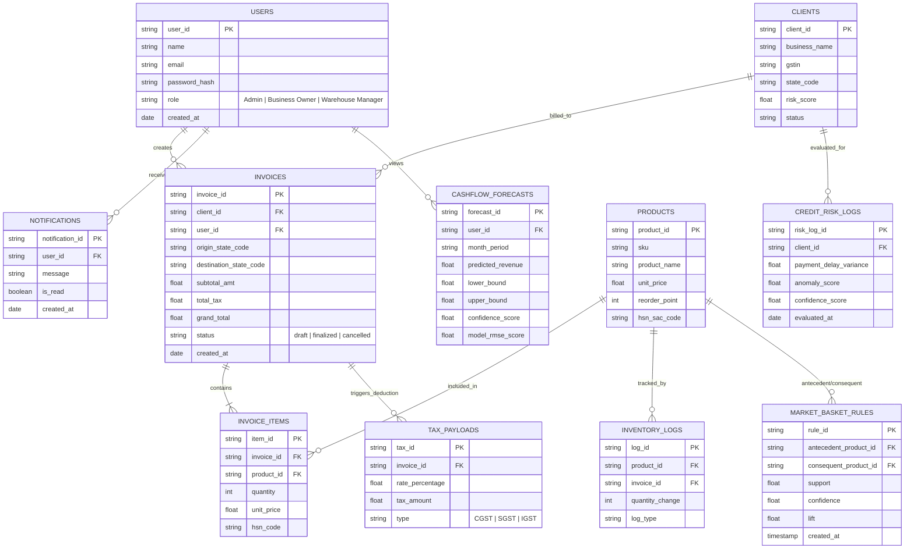

# Software Requirements Specification (SRS) for SmartLedger AI
**AI-Driven ERP & Intelligent Predictive Ledger System**

- **Document Version:** 1.0
- **Date:** July 15, 2026
- **Prepared By:** Gobi Krishna V., Gokul Ram G., Krishna Prabu R.
- **Institution:** MEPCO Schlenk Engineering College

---

## 1. Executive Summary & Purpose

**SmartLedger AI** is an AI-driven Enterprise Resource Planning (ERP) and predictive ledger platform designed for Small and Medium Businesses (SMBs). It automates GST-compliant invoicing, manages inventory, and leverages machine learning models to forecast cash flow, detect client credit risks, and discover cross-selling opportunities (market basket analysis).

### Core Goals
- Move SMBs from reactive accounting to data-driven proactive decision-making.
- Unified platform combining core ERP transactional features with AI/ML predictive analytics.
- Automated GST computation (CGST, SGST, IGST) based on state geo-tokens and HSN codes.
- Immutable ledger auditing and real-time WebSocket notifications.

---

## 2. System Architecture & Tech Stack

### High-Level Architecture
The system consists of three main components:
1. **Frontend Client:** Browser-based single-page application (React / Web technologies) with a dual-pane workspace (Left: multi-row invoicing matrix; Right: real-time analytical charts powered by Recharts/D3).
2. **ERP Core Server (Backend):** Node.js / Express application server handling RESTful APIs, authentication (JWT), business logic, GST tax calculations, and database operations.
3. **AI/ML Analytics Service:** Python-based microservice (Flask/FastAPI) hosting ML models for cash flow forecasting, market basket mining, and anomaly detection.
4. **Database:** MongoDB (BSON schemaless documents) for storing users, invoices, inventory, tax payloads, and ML model outputs.

### Tech Stack Summary
- **Frontend:** React, Recharts / D3.js, WebSockets (WSS client)
- **Backend:** Node.js, Express, JSON Web Tokens (JWT), Cors, Dotenv
- **Database:** MongoDB / Mongoose (BSON schemaless storage)
- **AI/ML Engine:** Python (Flask/FastAPI), PyTorch/TensorFlow (LSTM), Scikit-Learn (Isolation Forest), MLXtend / Custom (Apriori & FP-Growth)
- **Protocols:** HTTPS (REST APIs), WebSockets (`wss://`)

---

## 3. User Classes & Roles (RBAC)

| User Class | Description & Key Responsibilities | Primary Features Used |
|---|---|---|
| **Business Owner** | Financial decision-maker using billing and predictive insights daily. | Invoicing, Tax Engine, AI Cash Flow Dashboard, Market Basket Recs, Credit Risk Alerts. |
| **Warehouse Manager** | Operations user focusing on inventory levels and stock velocity. | Inventory matrix, stock velocity metrics, restock alerts. |
| **Admin** | High-privilege platform operator responsible for system maintenance. | User management (RBAC), master data management, ML model health monitoring (F1, RMSE), cluster health. |

---

## 4. Detailed Module Specifications & Requirements

### 4.1 User & Business Management Module
- **Priority:** High
- **Description:** Handles role-based access control (RBAC), authentication, registration, and user profiles.
- **Requirements:**
  - `REQ-1.1`: The system shall allow role-based registration and login for Business Owner, Warehouse Manager, and Admin roles.
  - `REQ-1.2`: The system shall provide profile management, authentication, and secure access control utilizing JSON Web Tokens (JWT).

### 4.2 Invoicing & Tax Engine Module
- **Priority:** High
- **Description:** Core billing matrix with automated CGST/SGST/IGST tax calculation.
- **Requirements:**
  - `REQ-2.1`: The system shall provide a multi-row invoice matrix with instant total recalculation without UI lag.
  - `REQ-2.2`: The system shall perform automated CGST/SGST/IGST tax computation based on HSN codes and state geo-tokens (intra-state vs inter-state).
  - `REQ-2.3`: The system shall enforce local input validation before transmitting data to the backend.

### 4.3 Inventory Management Module
- **Priority:** High
- **Description:** Dynamic stock tracking linked to sales and AI-driven restocking metrics.
- **Requirements:**
  - `REQ-3.1`: The system shall maintain stock tracking dynamically linked to invoice finalization and sales data.
  - `REQ-3.2`: The system shall generate AI-assisted inventory velocity metrics to guide automated restock scheduling.

### 4.4 Admin & Analytics Panel
- **Priority:** Medium
- **Description:** Oversight dashboard for master data management and ML performance metrics.
- **Requirements:**
  - `REQ-4.1`: The system shall allow management of master data, including clients, products, and tax brackets.
  - `REQ-4.2`: The system shall provide monitoring tools for ML model accuracy (F1 score, RMSE) and cloud cluster health.
  - `REQ-4.3`: The system shall display a comprehensive platform-wide analytics dashboard.

### 4.5 AI Market Basket Analysis Module
- **Priority:** High
- **Description:** Recommendation engine that discovers product cross-selling patterns from historical billing data.
- **Requirements:**
  - `REQ-5.1`: The system shall ingest historical invoice/transaction data to generate "frequently billed together" product recommendations.
  - `REQ-5.2`: The system shall utilize the Apriori algorithm for smaller datasets and FP-Growth for large-scale ledger scanning to perform frequent itemset mining.

### 4.6 Deep Learning Cash Flow Forecasting Module
- **Priority:** High
- **Description:** Time-series forecasting predicting future revenue and cash runway.
- **Requirements:**
  - `REQ-6.1`: The system shall implement LSTM (Long Short-Term Memory) based time-series forecasting of future revenue and cash runway.
  - `REQ-6.2`: The system shall generate and render a rolling 24-month projection derived from historical billing velocity.

### 4.7 Credit Risk Anomaly Detection Module
- **Priority:** High
- **Description:** Unsupervised learning model to detect clients with abnormal payment delay patterns or high default risk.
- **Requirements:**
  - `REQ-7.1`: The system shall employ an Isolation Forest model to flag clients with abnormal payment delay patterns.
  - `REQ-7.2`: The system shall perform continuous parsing of ledger clearance dates to compute payment variance.

### 4.8 Notification & Alerts Module
- **Priority:** Medium
- **Description:** Real-time push alerts and in-app notifications.
- **Requirements:**
  - `REQ-8.1`: The system shall push real-time alerts via secure WebSockets (`wss://`) for credit risk anomalies and predictive insights.
  - `REQ-8.2`: The system shall generate standard in-app notifications for invoice status updates and risk flags.

---

## 5. Nonfunctional Requirements

### 5.1 Performance Requirements
- **Client DOM Updates:** Multi-row invoice matrix changes must execute in `< 150 ms`.
- **Market Basket Recommendations:** Must return recommendations within `< 2 s` of adding an item.
- **Cash Flow Projections:** Deep Learning projections must render within `< 3 s` upon loading the dashboard.

### 5.2 Security & Data Privacy Requirements
- **Password Hashing:** Passwords must be hashed using strong one-way hashing algorithms (`bcrypt`).
- **Data Encryption:** Sensitive financial arrays at rest in MongoDB must use field-level encryption (`AES-256`).
- **PII Anonymization:** ML training datasets must be stripped of Personally Identifiable Information (PII) before tensor processing.
- **Transport Security:** All client-server communication must use HTTPS and JWT-based stateless authentication.

### 5.3 Safety & Data Integrity
- **Transactional Integrity:** Multi-document ledger updates must guarantee atomicity; failures mid-flight must trigger a full rollback to prevent unbalanced credits/debts.
- **Immutable Ledgers:** Finalized financial ledgers cannot be deleted. A cancellation transaction must be issued to maintain audit trails.
- **Model Fallback:** If background ML model retraining fails, the system must revert to previous stable weights without crashing the client interface.

---

## 6. Entity Relationship (ER) & Data Schema Overview

Below is the database entity design extracted from the system's ER diagram:

---

## 7. To Be Determined (TBD) Items

| # | Item Description | Reference Section |
|---|---|---|
| **TBD-1** | Integration logic for real-time bank account webhooks. | Section 3.2 |
| **TBD-2** | Definition of exact performance benchmarks after load testing under concurrent user load. | Section 5.1 |
| **TBD-3** | Implementation timeline for internationalization (i18n) multi-language support. | Section 6 |
