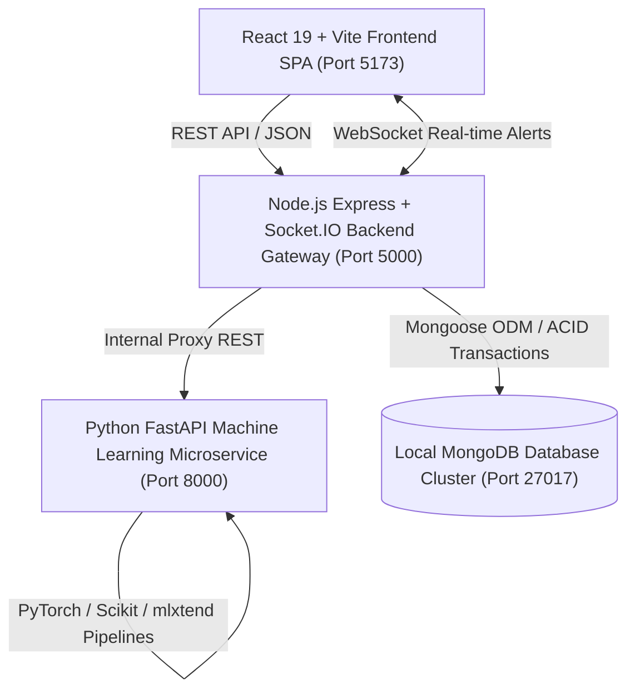

# SmartLedger AI ERP — System Architecture Specification

## 1. Overview
SmartLedger AI ERP is an enterprise-grade, full-stack predictive resource planning and intelligent point-of-sale platform built on a modernized MERN + Python AI microservices architecture. The system orchestrates high-speed retail/wholesale invoicing, real-time warehouse inventory management, double-entry financial ledger accounting, and continuous machine learning pipelines.

## 2. High-Level System Architecture Diagram

## 3. Port & Service Allocation

| Component | Technology | Port | Purpose |
| :--- | :--- | :--- | :--- |
| **Frontend Client** | React 19, Vite 8, Lucide, Tailwind/CSS-in-JS | `5173` | Responsive web UI for Cashier, Warehouse, Owner & Admin |
| **Backend Gateway** | Node.js, Express, Socket.IO, JWT, Bcrypt | `5000` | REST API gateway, authentication, business logic, WebSocket broker |
| **AI Microservice** | Python 3.13, FastAPI, PyTorch, Scikit-Learn | `8000` | Deep neural network forecasting, anomaly classification & association |
| **Database** | MongoDB Community Cluster | `27017` | Persistent operational and immutable ledger storage |

## 4. Architectural Layers

### 4.1 Client Presentation Layer (`client/`)
- Single-page application using modern React 19 hooks and declarative routing via `react-router-dom` v7.
- Strict Role-Based Protected Routes (`<ProtectedRoute allowedRoles={[...]} />`).
- Real-time Socket.IO subscriptions for instantaneous low-stock warnings, new invoices, and credit risk anomaly flags.
- Complete responsive layout supporting Desktop (1920×1080), Laptop (1366×768), Tablet (768×1024), and Mobile POS terminals (375×667).

### 4.2 Application Gateway Layer (`backend/`)
- Stateless JWT authentication with SHA-256 geo-token validation.
- Double-Entry General Ledger orchestration ensuring every transaction balances debits and credits.
- Indian Statutory GST Engine supporting intra-state (CGST + SGST) and inter-state (IGST) split based on origin and destination state codes.
- Cryptographic SHA-256 block hashing chaining successive invoices into a tamper-evident audit record.

### 4.3 Machine Learning Pipeline Layer (`ai-services/`)
- **Stacked-Bi-LSTM Time-Series Network**: 64 hidden units, 2 layers, 0.2 dropout forecasting 30-day liquidity and rolling 24-month horizon.
- **Isolation Forest Anomaly Detector**: 100 estimators, 0.05 contamination evaluating customer credit default risk with plain-English factor explainability.
- **Apriori & FP-Growth Market Basket Miner**: Frequent itemset mining calculating Support, Confidence, and Lift for cashier upsell prompts.
- **Inventory Velocity Engine**: Daily consumption velocity, Days of Inventory Remaining (DIR), and automated purchase order triggers.
