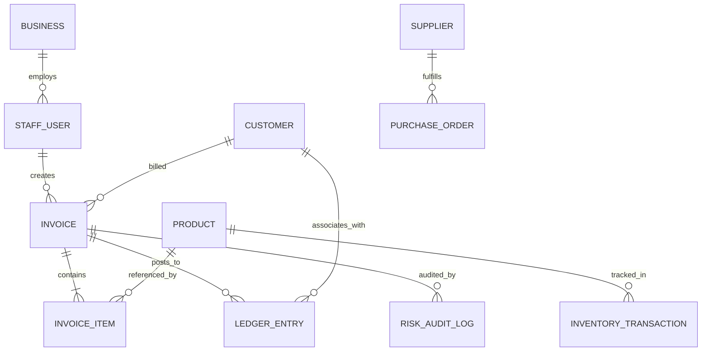

# SmartLedger AI ERP — Database Architecture & Schema Catalog

## 1. Overview
SmartLedger AI ERP utilizes MongoDB with Mongoose ODM to enforce strict document schemas, ACID transactions via sessions, and cryptographic immutability for financial compliance.

---

## 2. Core Entity Relationship Diagram

---

## 3. Schema Catalog

### 3.1 `Business`
- **Fields**:
  - `business_name` (String, required): Trade name of the business.
  - `legal_name` (String): Registered legal corporate identity.
  - `gstin` (String, required): 15-character statutory GST identification number.
  - `pan_number` (String): 10-character Permanent Account Number.
  - `state_code` (String, required): 2-digit GST state jurisdiction code (e.g., '29' for Karnataka).
  - `address` (Object): `{ line1, city, state, pincode, country }`.
  - `tax_configuration` (Object): `{ hsn_default_rate, enable_composition_scheme, round_off_totals }`.
  - `ai_alert_thresholds` (Object): `{ low_stock_buffer_days, payment_delay_variance_days, min_market_basket_lift }`.

### 3.2 `StaffUser`
- **Fields**:
  - `username` (String, unique): Login identifier.
  - `full_name` (String): Operator display name.
  - `email` (String, unique): Corporate email address.
  - `password_hash` (String): Bcrypt hashed credential.
  - `role` (String, enum: `['ADMIN', 'BUSINESS_OWNER', 'WAREHOUSE_MGR', 'CASHIER']`).
  - `branch_id` (String): Assigned retail terminal or warehouse depot.

### 3.3 `Invoice`
- **Fields**:
  - `invoice_no` (String, unique): Formatted invoice serial (e.g., `INV-2026-00001`).
  - `customer_id` (ObjectId, ref: `Customer`): Associated buyer.
  - `subtotal` (Number): Taxable sum before tax.
  - `cgst_total`, `sgst_total`, `igst_total` (Number): Statutory GST breakdowns.
  - `net_total` (Number): Final invoice payable in INR.
  - `crypto_hash` (String): Cryptographic SHA-256 block hash.
  - `prev_hash` (String): Hash of the preceding invoice in the ledger sequence.
  - `payment_method` (String, enum: `['CASH', 'UPI', 'CARD', 'NET_BANKING', 'CREDIT']`).
  - `payment_status` (String, enum: `['PAID', 'CREDIT_PENDING', 'VOID']`).

### 3.4 `LedgerEntry` (Double-Entry General Ledger)
- **Fields**:
  - `entry_id` (String, unique): Primary ledger sequence identifier.
  - `date` (Date): Posting timestamp.
  - `reference_no` (String): Originating document serial (e.g., `INV-2026-00001`).
  - `transaction_type` (String, enum: `['INVOICE', 'PAYMENT', 'PURCHASE', 'EXPENSE', 'ADJUSTMENT', 'CANCELLATION']`).
  - `account_name` (String): Targeted chart of accounts line.
  - `debit` (Number): Debited amount.
  - `credit` (Number): Credited amount.
  - `running_balance` (Number): Cumulative liquidity position after entry.
  - `is_immutable` (Boolean, default: true): Enforces deletion guard.

---

## 4. Immutability Architecture & Regulatory Guards

Pursuant to Section 5.5 of the official SRS:
1. **No Hard Deletes**: The `LedgerEntry` and `Invoice` schemas implement Mongoose `pre('deleteOne')` and `pre('deleteMany')` hooks that raise explicit runtime exceptions if any deletion attempt is detected on immutable financial records.
2. **Reversal Protocol**: If an invoice is cancelled, the system changes `payment_status` to `'VOID'`, restocks the products via an `InventoryTransaction` (`RETURN`), and posts an equal and opposite reversing entry (`Sales Returns & Allowances`) to the ledger.
3. **Cryptographic SHA-256 Ledger Chaining**: Each invoice calculates its hash by hashing `[invoiceNo + netTotal + timestamp + prevHash + branchId]`. Any tampering with historical rows invalidates the forward cryptographic chain.
